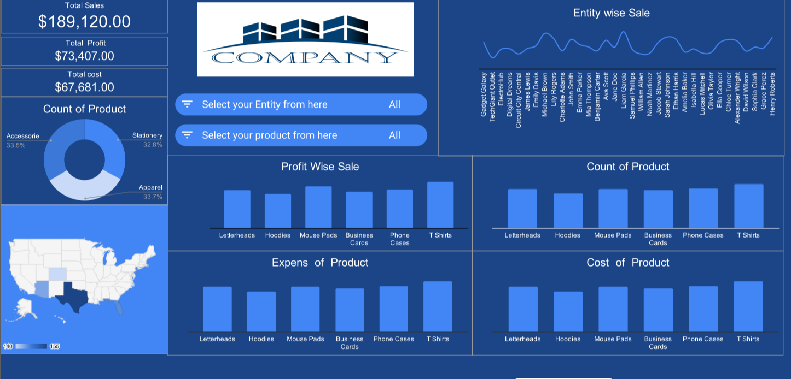

# Company Sales Dashboard — google sheet

<p align="center">
  
</p>

---

## Project Overview

This project presents an **interactive sales analytics dashboard** built using **Excel / Power BI** on real-world company transaction data spanning **January 2023 – December 2024**. The dataset contains **731 records** across **34 business entities**, **6 product lines**, and **3 product categories** sold across **5 US states**.

---

## Dataset Description

**File:** `company_data.xlsx`

| Column | Description |
|---|---|
| `Date` | Transaction date (2023–2024) |
| `Entity Name` | Business entity / sales representative |
| `Product` | Product sold (Letterheads, Hoodies, Mouse Pads, Business Cards, Phone Cases, T Shirts) |
| `Category` | Product category (Stationery, Apparel, Accessories) |
| `Location` | US State (Florida, Colorado, Texas, New Jersey, Arizona) |
| `Sales` | Total sales revenue ($) |
| `Cost` | Cost of goods sold ($) |
| `Margin` | Gross margin ($) |
| `Expenses` | Operating expenses ($) |
| `Profit` | Net profit ($) |
| `Margin %` | Gross margin percentage |
| `Profit %` | Net profit percentage |

---

##  Questions Solved / Business Problems Addressed

###  KPI & Summary Metrics
1. **What is the Total Sales revenue across all entities and products?**
   >  *Total Sales = $189,120*

2. **What is the Total Profit generated?**
   >  *Total Profit = $73,407*

3. **What is the Total Cost incurred across all transactions?**
   >  *Total Cost = $67,681*

---

###  Product Analysis
4. **What is the count (distribution) of products sold across all categories?**
   > Visualized as a **Donut Chart** — Accessories (33.5%), Apparel (33.7%), Stationery (32.8%)

5. **Which products generate the highest Profit?**
   > Analyzed via **Profit Wise Sale** bar chart across: Letterheads, Hoodies, Mouse Pads, Business Cards, Phone Cases, T Shirts

6. **What is the count of each product sold?**
   > Visualized via **Count of Product** bar chart for all 6 product lines

7. **What are the Expenses per product?**
   > Analyzed via **Expenses of Product** bar chart to identify high-cost items

8. **What is the Cost associated with each product?**
   > Visualized via **Cost of Product** bar chart for cost benchmarking

---

###  Entity / Sales Rep Analysis
9. **How do sales vary across different business entities?**
   > Visualized via **Entity Wise Sale** line chart for all 34 entities — helps identify top and bottom performers

10. **Which entities / sales reps are driving the most revenue?**
    > Filterable through the **Entity Selector** dropdown for drill-down analysis

---

###  Geographical Analysis
11. **Which US states contribute the most to overall sales?**
    > Visualized on a **US Choropleth Map** — Texas shows the highest concentration

---

###  Interactive Filtering
12. **How does performance change when filtered by a specific Entity?**
    > Interactive **Entity filter** dynamically updates all charts

13. **How does performance change when filtered by a specific Product?**
    > Interactive **Product filter** dynamically updates all charts

---

##  Dashboard Visuals

| Visual | Type | Insight |
|---|---|---|
| Total Sales / Profit / Cost | KPI Cards | High-level performance summary |
| Count of Product | Donut Chart | Category-wise product distribution |
| Entity Wise Sale | Line Chart | Sales trend across all 34 entities |
| Profit Wise Sale | Bar Chart | Profit comparison by product |
| Count of Product | Bar Chart | Volume of each product sold |
| Expenses of Product | Bar Chart | Expense breakdown per product |
| Cost of Product | Bar Chart | Cost breakdown per product |
| US Map | Choropleth | Geographic sales distribution |

---

##  Tools Used

- **Microsoft Excel / Power BI** — Dashboard creation & visualization
- **Data Range:** January 2023 – December 2024 (731 transactions)
- **Entities:** 34 business entities
- **Products:** 6 product lines across 3 categories
- **Geography:** 5 US States

---

##  How to Use

1. **Clone this repository**
   ```bash
   git clone https://github.com/your-username/company-sales-dashboard.git
   cd company-sales-dashboard
   ```

2. **Open the Excel file**
   ```
   Open company_data.xlsx in Microsoft Excel or import into Power BI Desktop
   ```

3. **Explore the Dashboard**
   - Use the **Entity Selector** to filter by business entity
   - Use the **Product Selector** to filter by product line
   - All charts update dynamically based on your selection

---

##  Repository Structure

```
company-sales-dashboard/
│
├── README.md               # Project documentation (this file)
├── company_data.xlsx       # Raw dataset + Dashboard
└── com.png                 # Dashboard screenshot
```

---

##  Key Insights

- **Total revenue** of **$189,120** with a healthy profit margin
- Product categories are nearly **evenly distributed** (~33% each)
- **Texas** is the strongest performing state geographically
- **34 entities** analyzed — significant variation in individual performance
- **2-year dataset** (2023–2024) enables year-over-year trend analysis

---

## Contributing

Feel free to fork this project, raise issues, or submit pull requests for improvements!

---

